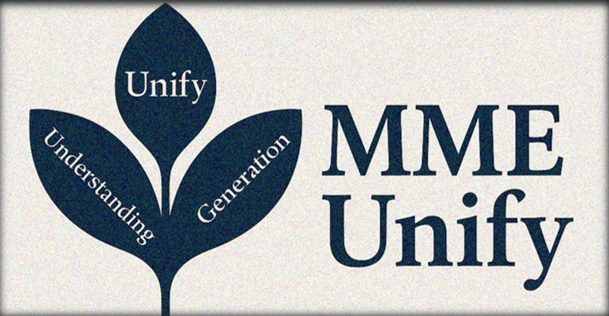
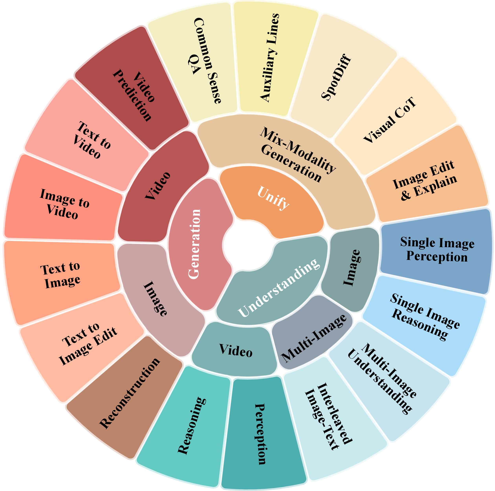

# MME-Unify: A Comprehensive Benchmark for Unified Multimodal Understanding and Generation Models

<p align="center">
    
</p>

<font size=7><div align='center' >  
[[📖 arXiv Paper](https://arxiv.org/abs/2502.10391)] 
[[📊 MME-Unify Data](https://huggingface.co/datasets/wulin222/MME-Unify)] 
[[📝 Homepage](https://mme-unify.github.io/)] 

</div></font>

**[2025/04/07]** 🔥 We are proud to open-source **MME-Unify**, a comprehensive evaluation framework designed to systematically assess U-MLLMs. Our benchmark includes:

- A **Standardized Traditional Task Evaluation** We sample from 12 datasets, covering 10 tasks with 30 subtasks, ensuring consistent and fair comparisons across studies.
- A **Unified Task Assessment** We introduce five novel tasks testing multimodal reasoning, including image editing, commonsense QA with image generation, and geometric reasoning.
- A **Comprehensive Model Benchmarking** We evaluate 12 leading U-MLLMs, such as Janus-Pro, EMU3, and VILA-U, Gemini-2-Flash-exp, alongside specialized understanding (e.g., Claude-3.5-Sonnet) and generation models (e.g., DALL-E-3/2).

Our findings reveal substantial performance gaps in existing U-MLLMs, highlighting the need for more robust models capable of handling mixed-modality tasks effectively.


<p align="center">
    
</p>

## Dataset Examples

<p align="center">
    
</p>


## Evaluation Pipeline

### Prompt ###
The common prompt used in our evaluation for different tasks can be found in:
```bash
MME-Unify/Prompt.txt
```

### Dataset ###
You can download images in our [Hugging Face repository](https://huggingface.co/datasets/wulin222/MME-Unify) and the final structure should look like this:

```
MME-Unify
├── CommonSense_Questions
├── Conditional_Image_to_Video_Generation
├── Fine-Grained_Image_Reconstruction
├── Math_Reasoning
├── Multiple_Images_and_Text_Interlaced
├── Single_Image_Perception_and_Understanding
├── Spot_Diff
├── Text-Image_Editing
├── Text-Image_Generation
├── Text-to-Video_Generation
├── Video_Perception_and_Understanding
└── Visual_CoT

```

You can found QA pairs in:
```bash
MME-Unify/Unify_Dataset
```
and the structure should look like this:
```
Unify_Dataset
├── Understanding
├── Generation
├── Unify_Capability
│   ├── Auxiliary_Lines
│   ├── Common_Sense_Question
│   ├── Image_Editing_and_Explaning
│   ├── SpotDiff
│   ├── Visual_CoT

```

### Evaluate ###
To extract the answer and calculate the scores, we add the model response to a JSON file. Here we provide an example template [output_test_template.json](./evaluation/output_test_template.json). Once you have prepared the model responses in this format, please refer to the evaluation scripts in:
```bash
MME-Unify/evaluate
```

## Dataset License

**License**:
```
MME-Unify is only used for academic research. Commercial use in any form is prohibited.
The copyright of all images belongs to the image owners.
If there is any infringement in MME-Unify, please email yifanzhang.cs@gmail.com and we will remove it immediately.
Without prior approval, you cannot distribute, publish, copy, disseminate, or modify MME-Unify in whole or in part. 
You must strictly comply with the above restrictions.
```

Please send an email to **yifanzhang.cs@gmail.com**. 🌟


## Citation

If you find it useful for your research and applications, please cite related papers/blogs using this BibTeX:
```bibtex
@article{zhang2025mm,
  title={MM-RLHF: The Next Step Forward in Multimodal LLM Alignment},
  author={Zhang, Yi-Fan and Yu, Tao and Tian, Haochen and Fu, Chaoyou and Li, Peiyan and Zeng, Jianshu and Xie, Wulin and Shi, Yang and Zhang, Huanyu and Wu, Junkang and others},
  journal={arXiv preprint arXiv:2502.10391},
  year={2025}
}
```

## Related Works

Explore our related researches:
- **[SliME]** [Beyond LLaVA-HD: Diving into High-Resolution Large Multimodal Models](https://github.com/yfzhang114/SliME)
- **[VITA]** [VITA: Towards Open-Source Interactive Omni Multimodal LLM](https://github.com/VITA-MLLM/VITA)
- **[Long-VITA]** [Long-VITA: Scaling Large Multi-modal Models to 1 Million Tokens with Leading Short-Context Accuracy](https://github.com/VITA-MLLM/Long-VITA)
- **[MME]** [MME: A Comprehensive Evaluation Benchmark for Multimodal Large Language Models](https://github.com/BradyFU/Awesome-Multimodal-Large-Language-Models/tree/Evaluation)
- **[Video-mme]** [Video-MME: The First-Ever Comprehensive Evaluation Benchmark of Multi-modal LLMs in Video Analysis](https://github.com/BradyFU/Video-MME)
- **[MME-RealWorld]** [Could Your Multimodal LLM Challenge High-Resolution Real-World Scenarios that are Difficult for Humans?](https://mme-realworld.github.io/)
- **[MME-Survey]** [MME-Survey: A Comprehensive Survey on Evaluation of Multimodal LLMs
](https://arxiv.org/abs/2411.15296)
- **[MM-RLHF]** [MM-RLHF: The Next Step Forward in Multimodal LLM Alignment](https://github.com/Kwai-YuanQi/MM-RLHF)
